 

Halo, saya **Fauzan** 👋
Saya membangun aplikasi Android dan website dengan prinsip sederhana: **rapi, ringan, dan benar-benar berguna.**
Senang bereksperimen, membongkar cara kerja sesuatu, lalu membuatnya sendiri.

  
  

---

### ▍Sedang dikerjakan

- 📱 Aplikasi Android untuk mengelola dan mengarsipkan file
- 🌐 Website bertema gelap dengan tampilan bersih
- 📚 Terus belajar: Kotlin, desain antarmuka, dan alur kerja yang efisien

### ▍Tech stack

<table>
  <tr>
    <td><b>Mobile</b></td>
    <td>
      
      
    </td>
  </tr>
  <tr>
    <td><b>Web</b></td>
    <td>
      
      
      
    </td>
  </tr>
  <tr>
    <td><b>Tools</b></td>
    <td>
      
      
    </td>
  </tr>
</table>

### ▍Statistik

  
  

  

---

Terima kasih sudah mampir. Kalau ada ide kolaborasi, kabari saja.
